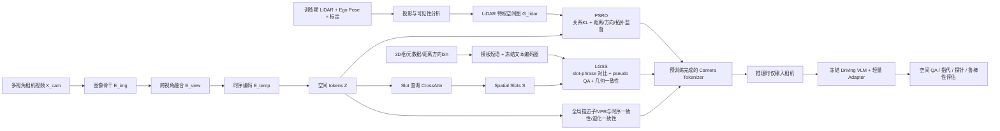

# GeoToken论文深度分析报告

## 执行摘要

GeoToken选题准确、方法构想有潜力：它把训练期 LiDAR 转成关系监督，并用弱语言把几何 token 接到冻结 VLM 上；但当前稿件仍是“方法已成形、证据未落地”的草稿，所有核心结果表均为 TBD，结论尚未被实证验证，复现细节与统计证据也明显不足。fileciteturn0file0 citeturn11academia0turn5academia1turn8academia3

## 论文概述与背景定位

这是一篇匿名 CVPR 投稿草稿，题为 **GeoToken: LiDAR-Privileged Spatial Token Pretraining for Camera-Only Driving VLMs**。论文的核心研究问题是：**能否在训练阶段利用 LiDAR 作为“特权空间教师”，让部署阶段仅使用多视角相机的驾驶 VLM 获得更可靠的度量空间推理能力**。作者提出两部分方法：其一是 **PSRD**，把 LiDAR 观测转成距离、方向、占据拓扑等关系图并蒸馏到相机 token 之间；其二是 **LGSS**，用自动生成的语义-空间短语将空间 token 进一步绑定到语言可索引的 slot。论文拟主张这类训练期 3D 感知 + 弱语言对齐，会提升 camera-only driving VLM 的空间问答、跨视角指代、冻结探针结果与鲁棒性；但需要强调的是，当前稿件自己也使用了“intended empirical claim”“if validated”等措辞，且主结果表全部为 TBD，因此**目前只能评价方法合理性，不能确认其经验结论成立**。fileciteturn0file0

这个问题本身很重要。DriveLM 把自动驾驶中的感知、预测、规划连接成图式 VQA，说明 VLM 可以成为驾驶推理接口；SimLingo 进一步表明 camera-only 的 VLM 体系也可以进入闭环驾驶；但是 DriveBench 与 DRIVESPATIAL 都指出，现有驾驶 VLM 往往会依赖语言先验、对视觉扰动敏感，并在多视角/时序场景构建上长期落后于人类；SpaceDrive 也把“细粒度 3D 空间关系理解不足”视为 VLM 自动驾驶的核心短板之一。换言之，**“能说会答”并不等于“真正具备可依赖的几何理解”**，GeoToken 对准的正是这个痛点。citeturn1academia0turn10academia1turn11academia0turn5academia1turn10academia0

从文献空白看，作者的动机总体充分，但论证还不够扎实。论文正确指出，许多 LiDAR→Camera 的蒸馏工作更偏向深度、BEV 特征或全局描述子，而不是 VLM 在语言接口上最容易失败的“关系式空间推理”；这与 UniDistill 这类以 BEV 前景蒸馏为核心的工作形成了明确差异，也与 VisionPAD 这种面向一般自动驾驶视觉表征的几何预训练不同。与此同时，SpatialVLM、SpatialRGPT、VLM-3R 等工作已经从 3D 数据生成、区域空间推理、重建增强等方向证明：**VLM 的空间能力可以通过额外空间监督显著增强**。因此，GeoToken 的定位不是“第一次做空间增强”，而是“第一次较系统地把 LiDAR 特权信息改写成**面向驾驶 VLM token 接口**的关系式空间预训练”。这个定位是成立的，但相关工作部分还应更完整地覆盖近两年空间 VLM 与驾驶 VLM 的代表性方法。fileciteturn0file0 citeturn8academia3turn3academia1turn0academia0turn9academia0turn9academia1

## 方法与技术路线拆解

从系统结构上看，GeoToken 的技术路线是清晰的：训练时输入多视角相机视频、同步 LiDAR、位姿和标定；通过图像 backbone、跨视角融合和时序编码器得到空间 token；再由 LiDAR 构建特权空间关系图，对 token 间关系进行蒸馏；之后再用自动生成的语义-空间短语为 token 读出 slots，并用对比学习/关系问答头做弱语言对齐；推理时完全移除 LiDAR 与文本编码器，只把 camera-only tokens 和 slots 交给冻结 VLM 的轻量适配器。这个两阶段设计在逻辑上是自洽的，也符合“训练时用昂贵传感器，部署时只保留廉价摄像头”的工程诉求。fileciteturn0file0

### 技术流程图

下图根据论文方法部分重绘了 GeoToken 的训练与推理路径。fileciteturn0file0

### 关键公式与严谨性判断

论文给出的核心公式大多属于**目标函数定义**，而不是严格意义上的理论推导。形式上是连贯的，但从审稿标准看，仍有多个“定义合理、实现关键未交代”的问题。fileciteturn0file0

| 模块 | 论文中的核心定义 | 作用 | 严谨性判断 | 主要问题 |
|---|---|---|---|---|
| Camera relation matrix | 用 token 间 attention 得到 \(R^{cam}_{ij}\) | 让学生 token 显式表达关系结构 | 形式合理 | 未说明是否做稀疏化、局部窗口或 pair sampling，复杂度近似为 \(O(L^2)\) |
| LiDAR relation matrix | 用 \(\exp(-\alpha d_{ij})\)、mask 和 \(\rho(o_{ij})\) 构造 \(R^{lidar}\) | 把 LiDAR 几何转成可蒸馏关系分布 | 形式合理 | \(\alpha\)、\(\rho(\cdot)\)、关系离散化、可靠性阈值均未说明 |
| \(\mathcal L_{rel}\) | KL 对齐 \(R^{lidar}\) 与 \(R^{cam}\) | 蒸馏 token 关系而非特征值 | 有针对性 | 只定义了行归一化关系，未讨论对称性和不确定性建模 |
| \(\mathcal L_{dist},\mathcal L_{dir},\mathcal L_{topo}\) | 从 token 对预测距离/方向/拓扑 | 补足关系细粒度监督 | 设计合理 | 图中定义了遮挡序关系 \(q_{ij}\)，但损失里并没有对应的 occlusion 项，这是最明显的方法不闭环之处 |
| LGSS | slot-phrase 对比、pairwise pseudo QA、geo-txt consistency | 让几何 token 可被语言检索 | 方向正确 | 多个对象可能共享同一模板短语，论文未说明 multi-positive 处理和 slot 去重策略 |
| 总损失 | PSRD + LGSS + VPR + 时序 + 退化一致性 | 兼顾空间、语言、定位和鲁棒性 | 工程上完整 | 各损失权重、训练日程和梯度平衡完全未说明 |

从公式一致性角度，最大的内部问题有三点。第一，论文在图关系中显式定义了 **occlusion / visibility order** 的 \(q_{ij}\)，但后续损失只监督了关系分布、距离、方向和拓扑，没有监督遮挡顺序；而实验却把 occlusion 作为主评测维度之一，这在“训练信号—评价目标”之间留下了断裂。第二，论文把图节点描述为“camera token 或 projected BEV cell”，但未说明这两种节点是否同时存在、如何统一维度和语义；如果混用，pairwise relation 的含义会发生变化。第三，LGSS 默认 slot 能稳定读出“一个对象/区域/关系”，但文中没有介绍任何 slot assignment 正则、Hungarian matching 或跨帧一致性约束，因此 slot 语义是否稳定，是一个尚未解决的关键实现细节。fileciteturn0file0

### 关键假设与可复现性要点

该方法依赖若干相当强的前提：其一，**相机-LiDAR 标定和时序同步足够精确**，否则关系图本身会噪声很大；其二，**LiDAR 投影后的可见 token 能覆盖多数关键空间关系**，但远距离、遮挡或稀疏点云区域可能监督不足；其三，**模板化弱语言足以把几何 token 握手给冻结 VLM**；其四，**冻结 VLM + 轻量 adapter 的改进可以代表 token 质量本身**。其中前两个是传感器与几何层面的假设，后两个是表示与接口层面的假设。论文已经意识到部分限制，但没有用实验设计去逐条验证这些假设。fileciteturn0file0

## 创新点与代表性文献对比

论文在贡献部分声明了四个创新：LiDAR-privileged spatial token pretraining、PSRD、LGSS，以及面向 VLM 的评测协议。就“是否新”“是否有用”“是否有理论价值”三条标准来看，这四项贡献并不等价：**真正最有新意的是“把 LiDAR 监督改写成面向 VLM token 的关系蒸馏”这一点；最弱的一项则是评测协议本身，它更像良好的实验设计，而非算法创新**。fileciteturn0file0

### 作者声称创新的逐条评估

下表依据论文的贡献段、方法段与实验段综合评估。fileciteturn0file0

| 作者声称的贡献 | 新颖性评估 | 实用性评估 | 理论价值评估 | 具体判断 |
|---|---|---|---|---|
| LiDAR-privileged spatial token pretraining for camera-only driving VLMs | 中高 | 高 | 中 | “训练时多模态、部署时单模态”并不新，但把目标从检测/BEV转向 VLM 可用 token，在自动驾驶语境下有较强新意 |
| PSRD：蒸馏距离、方向、占据拓扑关系 | 中高 | 高 | 中 | 相比深度回归或 BEV feature mimic，更贴近 VLM 的关系性失败模式；但本质仍是监督目标重设计，非全新学习范式 |
| LGSS：用弱语言把空间 token 对齐到 slot | 中 | 中高 | 中低 | 思路有用，能解释“几何如何被语言索引”；但模板短语与对比学习都不是新技术，创新主要在组合与场景化实现 |
| 冻结 VLM + 轻量 adapter 的 VLM-centered evaluation | 中低 | 高 | 低 | 很好的实验隔离设计，但更像 evaluation protocol contribution，不是核心方法创新 |

### 代表性文献引用信息与简要比较

下表选择了近五年内与本文最相关的五篇代表性工作，分别覆盖驾驶 VLM、空间 VLM、跨模态蒸馏、自动驾驶预训练与空间增强驾驶系统五条线。表后给出综合判断。citeturn1academia0turn0academia0turn8academia3turn3academia1turn10academia0

| 代表性文献 | 中文注释 | 与 GeoToken 的关系 |
|---|---|---|
| **Chonghao Sima et al., _DriveLM: Driving with Graph Visual Question Answering_** citeturn1academia0 | 把驾驶理解组织成图式 VQA，连接感知、预测、规划，是驾驶 VLM 任务定义与 benchmark 的代表作 | GeoToken 不直接重定义任务，而是想提供更“几何化”的视觉 token 给这类驾驶 VLM 使用 |
| **Boyuan Chen et al., _SpatialVLM: Endowing Vision-Language Models with Spatial Reasoning Capabilities_** citeturn0academia0 | 自动扩展到千万图像、二十亿级 3D 空间 VQA 样本，证明额外空间监督可显著增强 VLM 的定量空间推理 | GeoToken 与其动机高度一致，但监督来源换成 LiDAR 特权信息，且聚焦驾驶多视角视频 |
| **Shengchao Zhou et al., _UniDistill: A Universal Cross-Modality Knowledge Distillation Framework for 3D Object Detection in BEV_** citeturn8academia3 | 典型的 LiDAR→Camera 跨模态蒸馏，在 BEV 中做前景对齐，服务对象是 3D 检测 | GeoToken 和它共享“训练期 LiDAR，推理期相机”的范式，但 supervision target 从 BEV/检测换成 token 间空间关系 |
| **Haiming Zhang et al., _VisionPAD: A Vision-Centric Pre-training Paradigm for Autonomous Driving_** citeturn3academia1 | 用 3D Gaussian Splatting、多帧光度一致性和速度建模做自动驾驶视觉预训练，强调纯视觉几何表征 | VisionPAD 说明几何预训练确有价值，但它并不直接解决“如何让语言模型访问这些几何表征”的问题 |
| **Peizheng Li et al., _SpaceDrive: Infusing Spatial Awareness into VLM-based Autonomous Driving_** citeturn10academia0 | 把 3D 坐标作为显式 positional encoding 注入 VLM，用于联合语义与空间推理与规划 | SpaceDrive 更像“在 VLM 端显式注入空间编码”，GeoToken 则更像“在视觉 token 端预训练空间结构” |

综合比较后，可以把 GeoToken 的真实创新性概括为一句话：**它不是第一个用空间监督增强 VLM 的工作，也不是第一个做 LiDAR 特权学习的工作，但它可能是较早把“LiDAR 特权关系蒸馏 + 弱语言接口 + 驾驶 VLM token”三者系统拼接到一起的方案**。如果结果显著，这个组合式创新是足以成立的；如果结果只比 depth/BEV 辅助预训练提升很小，那么它的贡献就会被归类为“工程整合高于原理突破”。fileciteturn0file0 citeturn8academia3turn0academia0turn10academia0

## 实验设计与证据强度评估

从“实验蓝图”看，论文设计得其实不错。作者把评测分成四大家族：驾驶空间问答、空间指代、冻结空间探针、鲁棒性，并额外保留 VPR 作为表征保真任务；同时又通过“冻结 tokenizer 与 VLM，仅训练 adapter”的协议，尽量把性能提升归因到 token 质量而非大模型再训练。这种协议在方法论文里是加分项，因为它减少了“把提升归功于错误模块”的风险。fileciteturn0file0

但从“证据是否成立”看，当前版本的问题非常严重：**表 1 到表 6 的所有数值都是 TBD**，因此目前根本没有任何可验证的主结论、消融结论、鲁棒性结论或泛化结论。也正因为如此，摘要与结论中的性能主张都只能被视为待验证假设，而不是论文已经提供的证据。fileciteturn0file0

### 当前证据强度判断

| 维度 | 当前判断 | 依据 |
|---|---|---|
| 主结论是否被验证 | 很弱 | 全部主表与消融表均为 TBD，尚无任何量化结果 |
| 统计显著性 | 缺失 | 未报告多随机种子、均值方差、置信区间或配对显著性检验 |
| 消融实验充分性 | 设计上较好，证据上很弱 | ablation 维度丰富，但没有结果 |
| 基线选择合理性 | 中等 | 有 CLIP/DINOv2/depth/BEV/descriptor-only baseline，但仍缺少更强的空间 VLM 与 LiDAR-distillation 代表作 |
| 过拟合与选择性报告风险 | 中高 | 训练和评测都依赖 nuScenes 元数据、LiDAR 关系与模板短语，存在模式泄漏风险 |
| 鲁棒性证据 | 弱 | 只列出了 corruption 类型，未说明强度分级、采样策略与统计方式 |
| 跨数据集泛化证据 | 弱 | 虽列出 KITTI-360，但未说明 rig mismatch 下的适配协议与公平比较方式 |

基线方面，论文的“同一冻结 VLM、同一 adapter 容量”设置是公平的，这是优点。可问题在于：如果作者想证明“PSRD 比 depth-only、BEV-only 或 descriptor-only 更适用于 VLM 空间推理”，那就至少还需要补上**更直接的空间增强基线**，例如 SpatialVLM / SpatialRGPT 这类空间监督 VLM，以及更强的 LiDAR→Camera 蒸馏代表作；否则审稿人很容易质疑：提升是否只是因为“任何额外几何监督都会有帮助”，而不是 GeoToken 的关系式监督特别有效。fileciteturn0file0 citeturn9academia0turn0academia0turn8academia3

统计显著性方面，论文目前完全没有证据。由于空间 QA 很可能是**同一样本上的配对分类准确率比较**，最基本也应报告多随机种子下的 mean±std，并使用配对 bootstrap 或 McNemar 之类的显著性检验；否则即使未来补上了数值，审稿阶段也无法判断改进是否稳定。这个问题在自动驾驶 VLM 上尤其要紧，因为 DriveBench 与 DRIVESPATIAL 这类基准都已经表明模型对扰动与场景分布很敏感，小幅提升并不自动等于更可靠。citeturn11academia0turn5academia1

过拟合与选择性报告风险也不可忽视。GeoToken 的弱语言短语来自 3D 框、方向 bin、距离 bin 和 scene tags；额外的 spatial QA 也由 nuScenes 元数据和 LiDAR 关系自动构造。如果训练文本模板、测试问题模板、测试对象分布之间没有做严格去耦，那么模型完全可能在“语言模板—几何标签映射”上过拟合，而不是真正学会了开放式空间推理。这一点与 SpatialVLM、DriveBench、DRIVESPATIAL 的启示是一致的：**视觉 grounding 与场景构建能力，不能只靠模板问答分数来证明**。fileciteturn0file0 citeturn0academia0turn11academia0turn5academia1

## 优点、亮点与改进建议

### 优点与亮点

| 亮点 | 为什么有价值 |
|---|---|
| 选题击中了驾驶 VLM 的真实瓶颈 | 当前驾驶 VLM 的主要短板确实不是“能否识别物体”，而是“能否可靠地做空间关系推理” |
| 把 LiDAR 蒸馏目标从特征值改成关系结构 | 这比单纯深度/BEV mimic 更贴近语言推理中的比较、关联与跨视角对应问题 |
| 弱语言接口设计合理 | 仅有几何表征并不保证 VLM 能读取，LGSS 试图补足“几何—语言接口”这一真实缺口 |
| 冻结 VLM 的评测协议很干净 | 这有助于把收益归因到 token 质量，而非大模型微调能力 |
| 同时考虑鲁棒性与原任务保真 | 增加 VPR retention 与 corruption consistency，说明作者考虑到了工程部署而非单一 benchmark 刷分 |
| 自我局限性意识较强 | 论文明确承认需要 paired camera-LiDAR 数据、模板语言有偏差、闭环驾驶尚未评测，这一点比许多过度宣称的论文更诚实 |

上述优点主要来自稿件的任务定义、方法分解与实验规划本身。尤其值得肯定的是，GeoToken 并没有简单地把 LiDAR 当成“更强 teacher features”，而是试图把它变成**更适合语言模型消费的空间结构先验**；这使它比传统感知蒸馏更贴近 driving VLM 的实际需求。fileciteturn0file0

### 按优先级排序的改进建议

| 优先级 | 改进建议 | 预期效果 | 实现难度 |
|---|---|---|---|
| 高 | **补齐所有主结果、消融结果与三次以上随机种子统计**，报告 mean±std 与配对显著性检验 | 直接把“概念草稿”升级为“可审稿的实证论文” | 中 |
| 高 | **把 occlusion 监督补闭环**：为 \(q_{ij}\) 增加显式损失，或删去相关宣称并解释为何无需监督 | 修复方法—实验之间最明显的不一致，增强技术可信度 | 中 |
| 高 | **加入更强比较基线**：至少补 SpatialVLM / SpatialRGPT 思路适配版、UniDistill 或其他 LiDAR→Camera 代表作、以及 SpaceDrive 式空间增强基线 | 提高新颖性说服力，防止审稿人认为“只是任何几何监督都有用” | 高 |
| 高 | **严格控制数据泄漏**：训练模板、测试模板、同义改写、对象组合、距离/方向 bin 使用严格 disjoint 或 hard split | 降低模板记忆与 pseudo-label 泄漏风险，证明真正的空间泛化 | 中 |
| 中 | **补充效率与可扩展性分析**：报告 token 数、pair sampling 策略、训练耗时、显存、推理延迟 | 回答 \(O(L^2)\) 关系损失是否可实际训练，提升工程可信度 | 中 |
| 中 | **加闭环或规划代理评测**：例如 Bench2Drive、开放环轨迹规划、行为克隆代理任务 | 证明空间 token 改善不仅体现在 QA，也能转移到驾驶决策 | 高 |
| 中 | **细化 LGSS 的 slot 机制**：说明 multi-positive、slot 去重、跨帧一致性、slot-to-object 匹配方式 | 提高语言对齐部分的可解释性和稳定性 | 中 |
| 中 | **补全写作与 bib 信息**：删除“work3”残留、核对 reference venue/year、统一术语 | 明显改善稿件成熟度，减少低级失分 | 低 |

这里特别强调两条。第一，稿件中出现了“original work3-style setup”“original work3 localization objective”等明显残留表述，说明论文还没有完成最终整理；对于 CVPR 级别审稿，这类问题虽然不致命，但会显著降低完成度印象。第二，VLM-3R、SpaceDrive、VisionPAD 等参考文献在当前公开检索页上主要能找到的是 arXiv 版本，稿中若写成特定会议正式版本，应在最终 bib 中核验。fileciteturn0file0 citeturn9academia1turn10academia0turn3academia1

## 后续研究方向与可复现性清单

### 可行的后续研究方向

| 后续方向 | 研究目标 | 方法要点 | 评估指标 |
|---|---|---|---|
| 不确定性感知的关系蒸馏 | 解决稀疏/远距离/恶劣天气下 LiDAR 监督噪声问题 | 给关系边增加 teacher confidence，对低密度点云区域降权或做 Bayesian relation loss | Spatial QA、ECE、robust accuracy、OOD 性能 |
| 更高阶空间图而非仅 pairwise relation | 让模型学习“对象—对象—区域”三元关系与路径可达性 | 从 pairwise graph 升级为 triplet/hypergraph，增加 free-space 连通性/遮挡链推理 | Topology QA、跨视角对应、复杂指代准确率 |
| 更自然的语言接口 | 降低模板偏置，提高 VLM 可读性与泛化性 | 用 LLM 生成多样化同义短语与问句，构造成 hard paraphrase split | Referring Acc、Paraphrase Acc、R@K、人工评测 |
| 迈向闭环驾驶验证 | 检验空间 token 改善是否真能带来规划收益 | 将 tokenizer 接到闭环 driving agent 或 open-loop 规划模型中，冻结/半冻结对比 | Driving Score、碰撞率、轨迹误差、成功率 |

这些方向与现有外部文献也能形成自然衔接：DriveBench 与 DRIVESPATIAL 提醒我们不能只看模板 QA；SpaceDrive 与 SimLingo 则说明若空间表征真的有效，最终应该能迁移到规划与闭环行为上。citeturn11academia0turn5academia1turn10academia0turn10academia1

### 可复现性清单

以下清单按“复现实验最需要什么”来组织，并标明当前稿件是否给出。可以看到，**数据来源大体明确，但实现级信息缺口很大**。fileciteturn0file0

| 类别 | 复现所需内容 | 论文状态 | 缺失信息 |
|---|---|---|---|
| 代码 | tokenizer、graph builder、PSRD、LGSS、adapter 训练代码 | 未提供 | 全部缺失 |
| 预训练视觉骨干 | E_img 的确切模型与 checkpoint | 部分说明 | 仅举例 DINOv2 / SigLIP / CLIP，未指定最终采用哪个版本与尺寸 |
| tokenizer 结构 | token 长度 \(L\)、patch 数 \(L_p\)、通道维 \(C\)、时序层数、view-aware attention 结构 | 部分说明 | 绝大多数细节未说明 |
| slot 机制 | slot 数 \(K\)、初始化、共享/不共享、跨帧策略 | 部分说明 | \(K\) 未说明，slot 归属机制未说明 |
| LiDAR 图构建 | 投影规则、BEV cell 尺寸、可见性阈值、pair 采样、occlusion 计算方法 | 部分说明 | 几乎都未说明 |
| 标签离散化 | 距离 bin、方向 bin、拓扑类别、quality mask 规则 | 部分说明 | bin 边界与类别定义未说明 |
| 损失权重 | \(\lambda_{rel},\lambda_{dist},\lambda_{dir},\lambda_{topo},\lambda_{slot},\lambda_{qa},\lambda_{gt},\lambda_{vpr},\lambda_{temp},\lambda_{cons}\) | 已给符号 | 数值全部未说明 |
| 训练超参 | optimizer、学习率、batch size、epoch、warmup、weight decay、temperature \(\tau\)、margin \(\Delta\)、\(\alpha\) | 未说明 | 全部缺失 |
| 数据划分 | nuScenes / KITTI-360 划分、DriveLM-nuScenes 用法、额外 pseudo-QA 的 train/val/test 划分 | 部分说明 | 具体 split 与去泄漏策略未说明 |
| 评测协议 | 冻结 VLM 的具体型号、prompt 模板、adapter 结构与参数量 | 部分说明 | “same frozen VLM” 已说，但具体 VLM 未说明 |
| 鲁棒性设置 | corruption 类型、强度分级、采样概率、训练/测试是否一致 | 部分说明 | 强度与采样策略未说明 |
| 硬件 | GPU 型号、卡数、显存、训练时长、混合精度 | 未说明 | 全部缺失 |
| 随机性控制 | 随机种子、运行次数、结果聚合方式 | 未说明 | 全部缺失 |
| 结果可验证性 | 主表、消融表、可视化、错误分析 | 框架已列出 | 数值与图像均未提供 |

综合而言，GeoToken 当前最有价值的地方，不是“重新发明了一套全新的几何学习理论”，而是把三条已有研究线——**LiDAR 特权学习、关系式空间监督、弱语言对齐**——整合到了一个面向驾驶 VLM token 的统一框架中。如果最终实验能证明它相对 depth-only、BEV-only 与 descriptor-only 蒸馏有稳定且显著的优势，这会是一篇有竞争力的方法论文；但以目前草稿形态来看，它更像一篇**方法 proposal + 实验计划书**，而不是证据完整的投稿终稿。fileciteturn0file0 citeturn8academia3turn0academia0turn10academia0